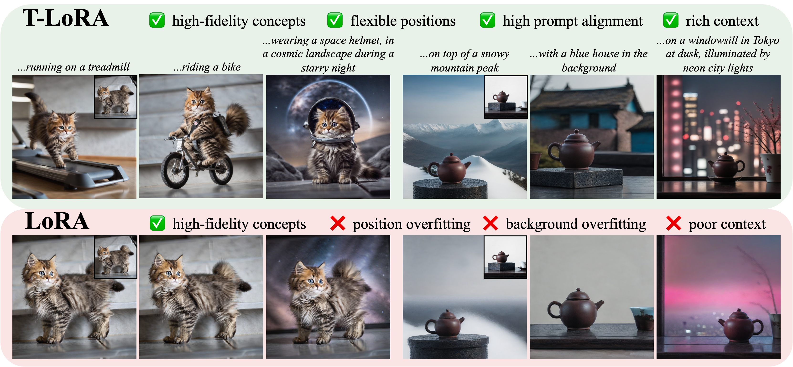
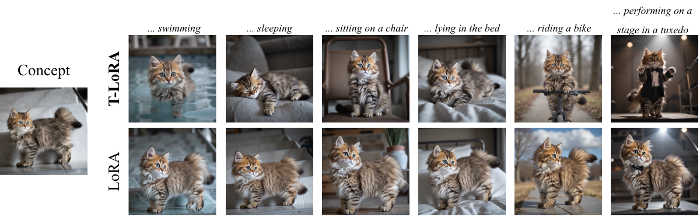

# DHT-Adapter: Dynamic Hierarchical Low-Rank Adaptation across Diffusion Timesteps

<a href="https://arxiv.org/abs/2507.05964"></a><!-- <a href="https://arxiv.org/abs/2502.06606"></a> -->
<a href="https://controlgenai.github.io/T-LoRA/"><a>
[](./LICENSE)

>While diffusion model fine-tuning offers a powerful approach for customizing pre-trained models to generate specific objects, it frequently suffers from overfitting when training samples are limited, compromising both generalization capability and output diversity. This paper tackles the challenging yet most impactful task of adapting a diffusion model using just a single concept image, as single-image customization holds the greatest practical potential. We introduce T-LoRA, a Timestep-Dependent Low-Rank Adaptation framework specifically designed for diffusion model personalization. In our work we show that higher diffusion timesteps are more prone to overfitting than lower ones, necessitating a timestep-sensitive fine-tuning strategy. T-LoRA incorporates two key innovations: (1) a dynamic fine-tuning strategy that adjusts rank-constrained updates based on diffusion timesteps, and (2) a weight parametrization technique that ensures independence between adapter components through orthogonal initialization. Extensive experiments show that T-LoRA and its individual components outperform standard LoRA and other diffusion model personalization techniques. They achieve a superior balance between concept fidelity and text alignment, highlighting the potential of T-LoRA in data-limited and resource-constrained scenarios.
>




## 📌 Updates
- [21/04/2026] 🧩 **PEFT branch released** — T-LoRA reimplemented on 🤗 [PEFT](https://github.com/huggingface/peft) + 🤗 [Diffusers](https://github.com/huggingface/diffusers), with built-in multi-adapter support and a [LoRAShop](https://github.com/gemlab-vt/LoRAShop) integration for multi-concept generation. See the [`peft` branch](https://github.com/ControlGenAI/T-LoRA/tree/peft).
- [04/02/2026] 🚀 T-LoRA on FLUX.1-dev release
- [08/11/2025] 🎉 T-LoRA accepted to AAAI 2026
- [08/07/2025] 🔥 T-LoRA release

## 🧩 T-LoRA now on PEFT

T-LoRA is now also available as a native 🤗 [PEFT](https://github.com/huggingface/peft) + 🤗 [Diffusers](https://github.com/huggingface/diffusers) implementation — with built-in multi-adapter support and a ready-to-use [LoRAShop](https://github.com/gemlab-vt/LoRAShop) integration for **multi-concept generation** on FLUX.1-dev — all in the [`peft`](https://github.com/ControlGenAI/T-LoRA/tree/peft) branch.


Highlights:

- **PEFT-native adapters** (safetensors + metadata), plug-and-play with any Diffusers pipeline via a single `enable_timestep_hook(...)` call.
- **Multi-adapter support** — load, switch or combine several T-LoRA adapters at inference time.
- **LoRAShop integration out of the box** — generate images featuring multiple custom concepts in a single denoising pass.
- **FLUX.1-dev** and **SD-XL** training scripts adapted from the official 🤗 Diffusers DreamBooth examples.

```bash
git clone https://github.com/ControlGenAI/T-LoRA.git -b peft
```

Full details and examples: [`peft` branch README](https://github.com/ControlGenAI/T-LoRA/tree/peft#readme).

---

## 📌 Prerequisites

To run our method, please ensure you meet the following hardware and software requirements:
- Operating System: Linux
- NVIDIA GPU + CUDA CuDNN
- Conda 24.1.0+ or Python 3.11+

🤗 [Diffusers](https://github.com/huggingface/diffusers) library is used as the foundation for our method implementation.


## T-LoRA on FLUX.1-dev

The extended version of our paper includes additional results for the FLUX.1-dev model. [Here](https://github.com/ControlGenAI/T-LoRA/tree/main/flux) we provide code for this experiments. Below is an example demonstrating how to train T-LoRA and run inference with this model.



### 📌 Setup

* Clone this repo:
```bash
git clone https://github.com/ControlGenAI/T-LoRA.git
cd T-LoRA/flux
```

* Install requirements
```bash
pip install -r requirements.txt
```

### Training

You can launch T-LoRA training with the dog-example sourced from [DreamBooth Dataset](https://github.com/google/dreambooth):

```bash

export MODEL_NAME="black-forest-labs/FLUX.1-dev"
export INSTANCE_DIR="dog_example"
export OUTPUT_DIR="trained-flux-tlora_dog"

accelerate launch run.py \
  --pretrained_model_name_or_path=$MODEL_NAME \
  --train_data_dir=$INSTANCE_DIR \
  --output_dir=$OUTPUT_DIR \
  --mask_dir=None \ # provide a path to subject mask dir if you want masked loss
  --class_name="dog" \
  --placeholder_token="sks" \
  --max_train_steps=1000 \
  --checkpointing_steps=100 \
  --validation_prompt="a {0} in the jungle#a {0} in a cozy living room" \
  --one_image="02.jpg" \ # remove if you prefer full dataset training
  --tlora \
  --rank=32 \
  --min_rank=1 \
```

We are utilizing the following flags in the command mentioned above

* `mask_dir` here you can provide a folder with the target image masks to further disentangle the subject from the background. Masks can be obtained via [this code](https://github.com/fenghora/personalize-anything/tree/main/scripts). Mask filenames must match their corresponding image filenames. This is recommended for fine-tuning for people.
* `validation_prompts` - this flag allows you to specify a string of validation prompts separated by #, enabling the script to perform several validation inference runs.
* `one_image="00.jpg"`- this flag initiates training using a single selected image. Remove this flag if you prefer to train on the full dataset.

The optimal number of training steps may vary depending on the specific concept.

### FLUX adapter parameterizations

The FLUX implementation supports the original LoRA/T-LoRA adapter and a BSA
parameterization with a trainable rank-by-rank middle matrix:

\[
\Delta W(t) = B M(t) (S - S_{ref}) M(t) A
\]

`A` and `B` are frozen in BSA mode, only `S` is optimized, and `M(t)` keeps the
original timestep-dependent rank schedule. Existing checkpoints remain
compatible because `--adapter_type=lora` is the default.

Random frozen-basis BSA uses non-zero random `A` and `B`, with `S=0` and
`S_ref=0`, so the initial adapter update is exactly zero:

```bash
accelerate launch run.py \
  --pretrained_model_name_or_path="$MODEL_NAME" \
  --instance_data_dir="$INSTANCE_DIR" \
  --output_dir="$OUTPUT_DIR" \
  --class_name="dog" \
  --placeholder_token="sks" \
  --max_train_steps=1000 \
  --checkpointing_steps=100 \
  --tlora \
  --adapter_type=bsa \
  --bsa_init=random \
  --rank=32 \
  --min_rank=1
```

SVD BSA decomposes each pretrained attention projection `W0` directly (not a
gradient matrix), initializes `B=U_r`, `S=S_ref=Sigma_r`, and `A=V_r^T`, then
trains only `S`. Subtracting `S_ref` dynamically preserves the original model
at initialization for every timestep-dependent rank:

```bash
accelerate launch run.py \
  --pretrained_model_name_or_path="$MODEL_NAME" \
  --instance_data_dir="$INSTANCE_DIR" \
  --output_dir="$OUTPUT_DIR" \
  --class_name="dog" \
  --placeholder_token="sks" \
  --max_train_steps=1000 \
  --checkpointing_steps=100 \
  --tlora \
  --adapter_type=bsa \
  --bsa_init=svd \
  --bsa_svd_device=auto \
  --bsa_svd_oversample=4 \
  --bsa_svd_niter=4 \
  --rank=32 \
  --min_rank=1
```

`--bsa_svd_device=auto` performs each truncated SVD on the device holding the
pretrained projection. Use `cpu` to reduce the temporary GPU-memory peak at the
cost of slower initialization. BSA checkpoints save frozen `A`/`B`, trainable
`S`, and `S_ref`; inference restores these tensors directly and does not repeat
the SVD.


After the training you will obtain the experiment folder in the following structure:

```
trained-tlora_dog
└───*****-****-dog_example_tlora32
    └───checkpoint-100
        └───lora.pt
    └───checkpoint-200
    │   ...
    │
    └───logs
        └───hparams.yml

```

### Inference

```bash

export EXP_PATH="trained-tlora_dog/*****-****-dog_example_tlora32"

python run_inference.py \
  --exp=$EXP_PATH \
  --checkpoint_idx=800 \
  --prompts="a {0} riding a bike#a {0} dressed as a ballerina#a {0} dressed in a superhero cape, soaring through the skies above a bustling city during a sunset" \  # a string of prompts separated by #
```

This command will generate images in the corresponding checkpoint folder.

## T-LoRA on SD-XL
Below is an example demonstrating how to train T-LoRA and run inference with SD-XL.
### 📌 Setup

* Clone this repo:
```bash
git clone https://github.com/ControlGenAI/T-LoRA.git
cd T-LoRA
```

* Setup the environment. Conda environment `tlora` will be created and you can use it.
```bash
conda env create -f tlora_env.yml
conda activate tlora
```

### 📌 Training

You can launch T-LoRA training with the dog-example sourced from [DreamBooth Dataset](https://github.com/google/dreambooth):

```bash

export MODEL_NAME="stabilityai/stable-diffusion-xl-base-1.0"
export INSTANCE_DIR="dog_example"
export OUTPUT_DIR="trained-tlora_dog"
export API_KEY="your-wandb-api-key"

accelerate launch train.py \
  --pretrained_model_name_or_path=$MODEL_NAME \
  --train_data_dir=$INSTANCE_DIR \
  --output_dir=$OUTPUT_DIR \
  --mixed_precision="no" \
  --trainer_type="ortho_lora" \  # choose "lora" in case you want to train Vanilla T-LoRA
  --trainer_class="sdxl_tlora" \
  --num_train_epochs=800 \
  --checkpointing_steps=100 \
  --resolution=1024 \
  --wandb_api_key=$API_KEY \  # remove if you prefer not to log during training 
  --validation_prompts="a {0} lying in the bed#a {0} swimming#a {0} dressed as a ballerina" \  # a string of prompts separated by #
  --num_val_imgs_per_prompt=3 \
  --placeholder_token="sks" \
  --class_name="dog" \
  --seed=0 \
  --lora_rank=64 \
  --min_rank=32 \
  --sig_type="last" \
  --one_image="02.jpg" \ # remove if you prefer full dataset training
```

We are utilizing the following flags in the command mentioned above

* `wandb_api_key=$API_KEY` will ensure the training runs are tracked on [Weights and Biases](https://wandb.ai/site). To use it, make sure to install Weights and Biases with `pip install wandb` and provide your API key as an argument.
* `validation_prompts` - this flag allows you to specify a string of validation prompts separated by #, enabling the script to perform several validation inference runs.
* use `trainer_type="ortho_lora"` if you prefer to train T-LoRA and `trainer_type="lora"` in case you want to train Vanilla T-LoRA. `sig_type="last"` flag ensures that training starts from weights initialized with the last singular values of the matrices.
* `one_image="00.jpg"`- this flag initiates training using a single selected image. Remove this flag if you prefer to train on the full dataset.

The optimal number of training steps may vary depending on the specific concept.
We conducted our experiments using a single GPU setup on the Nvidia Н100. Training each individual model is expected to take approximately 30 minutes.


After the training you will obtain the experiment folder in the following structure:

```
trained-tlora_dog
└───*****-****-dog_example_tortho_lora64
    └───checkpoint-100
        └───pytorch_lora_weights.safetensors
    └───checkpoint-200
    │   ...
    │
    └───logs
        └───hparams.yml

```
### 📌 Inference

```bash

export CONFIG_PATH="trained-tlora_dog/*****-****-dog_example_tortho_lora64/logs/hparams.yml"

python inference.py \
  --config_path=$CONFIG_PATH \
  --checkpoint_idx=800 \
  --guidance_scale=5.0 \
  --num_inference_steps=25 \
  --prompts="a {0} riding a bike#a {0} dressed as a ballerina#a {0} dressed in a superhero cape, soaring through the skies above a bustling city during a sunset" \  # a string of prompts separated by #
  --num_images_per_prompt=5 \
  --version=0 \
  --seed=0 \
```

This command will generate images in the corresponding checkpoint folder.

## 🙏 Acknowledgements
We sincerely thank the 🤗 [Huggingface](https://huggingface.co) community for their open-source code and contributions.

## 📌 Citation

If our work assists your research, feel free to give us a star ⭐ and cite us using:
```
@misc{soboleva2025tlorasingleimagediffusion,
      title={T-LoRA: Single Image Diffusion Model Customization Without Overfitting}, 
      author={Vera Soboleva and Aibek Alanov and Andrey Kuznetsov and Konstantin Sobolev},
      year={2025},
      eprint={2507.05964},
      archivePrefix={arXiv},
      primaryClass={cs.CV},
      url={https://arxiv.org/abs/2507.05964}, 
}
```
